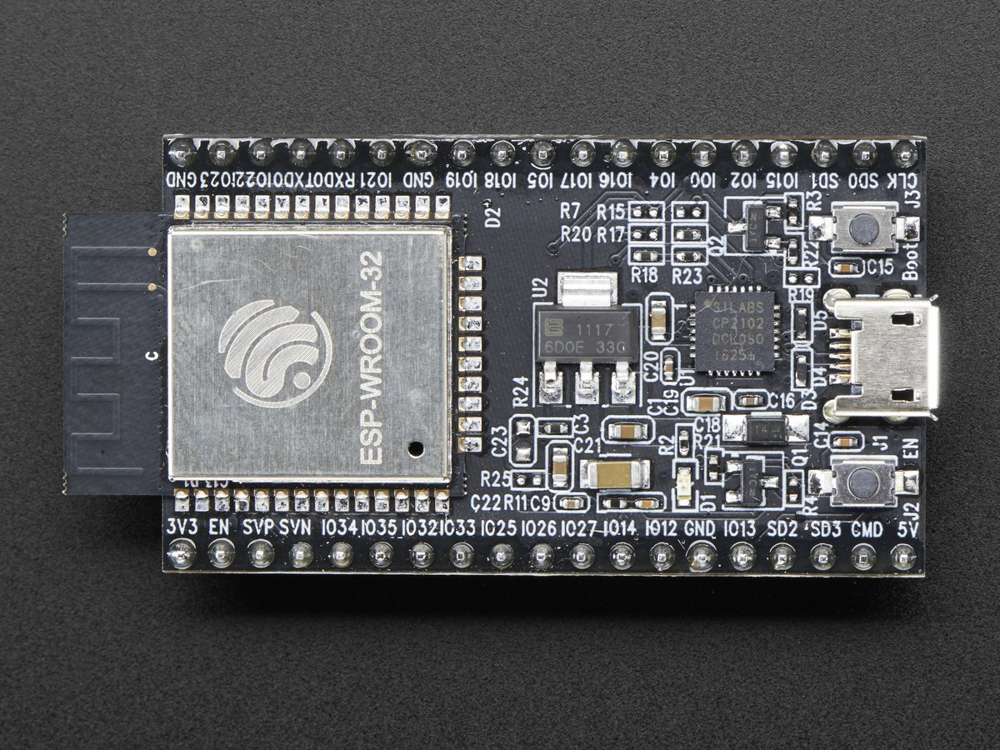
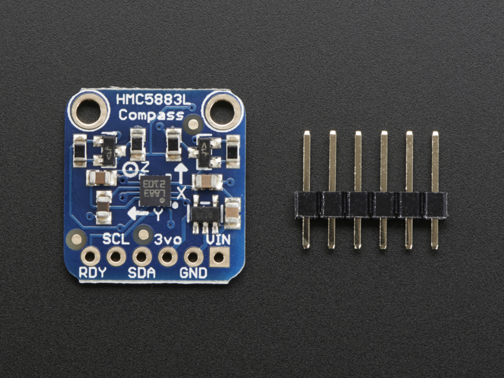
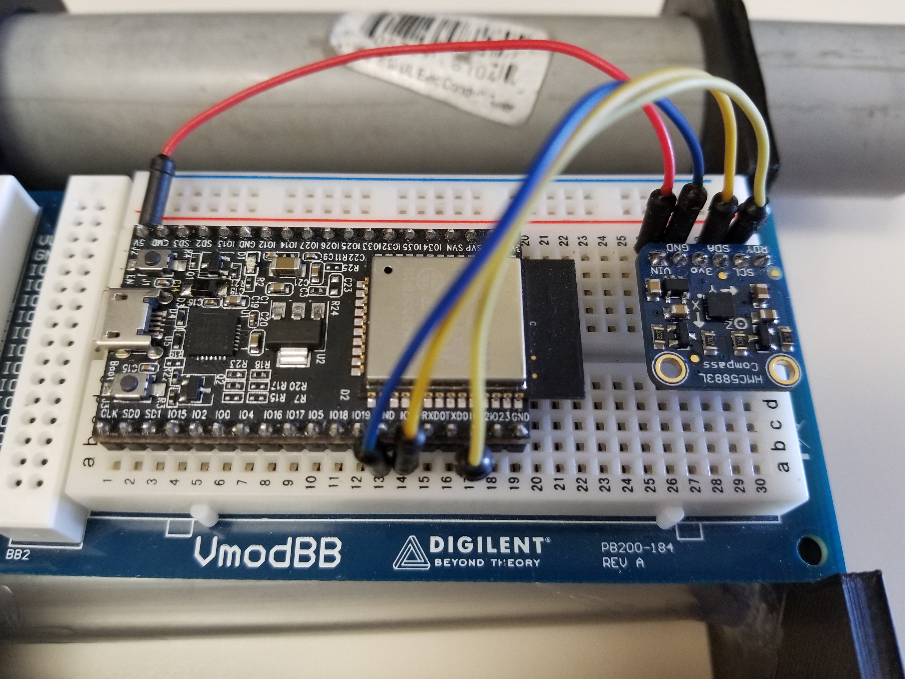
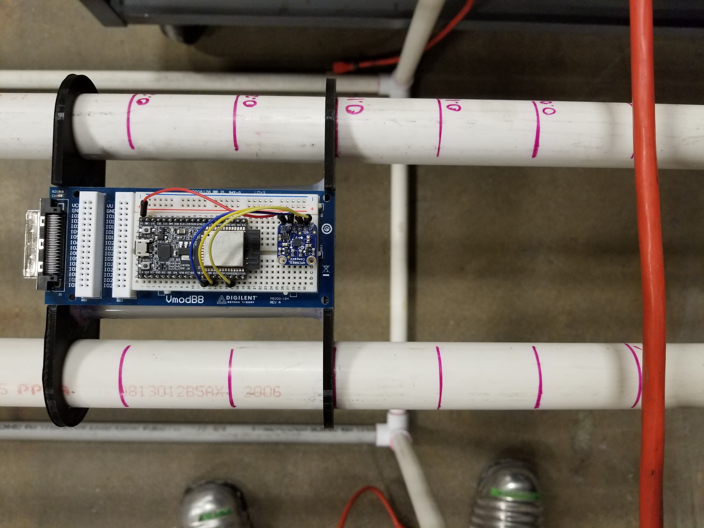

Hardware
========

This section goes into detail about what type of hardware was used during 
the project and what purpose it served.

Micro Controller
----------------

The micro controller used for the entirety of this project was Espressif's ESP32 Developement
Board. This board was chosen due its competitive cost, large onboard memory, and dual core 
functionality. The dual core system onboard the ESP32 was utilized in a way that the first core
was responsible for transmission/recovery of data via the serial port and the second core was 
used to communicate to the HMC5883L (described below), retrieve its data, and format it correctly
before passing it back to Jupyter. 

ESP32 Specifications: http://esp32.net/#Features

Magnetometer
------------

The magnetometer selected for this project is Honeywell's Magnetometer Compass (HMC5883L). The HMC
was chosen due to its ability to provide 1-2 degree heading accuracy with a range of --800 microTesla (uT)
to +800 uT all while having a data output rate of upto 160Hz.

	
HMC5883L Datasheet: https://cdn-shop.adafruit.com/datasheets/HMC5883L_3-Axis_Digital_Compass_IC.pdf

Component Configuartion
-----------------------

For this project, the ESP32 Developement Board and HMC5883L are connected via 4 wires (Picture 1).
They both were fixated upon the same breadboard and the entire configuartion sat ontop of a 3D printed cart
that would allow for steady movement in one axis in respect to the wire (Picture 2).

+-----------+-----------+
| Picture 1 | Picture 2 |
+===========+===========+
|  |Board|  |  |Slide|  |
+-----------+-----------+